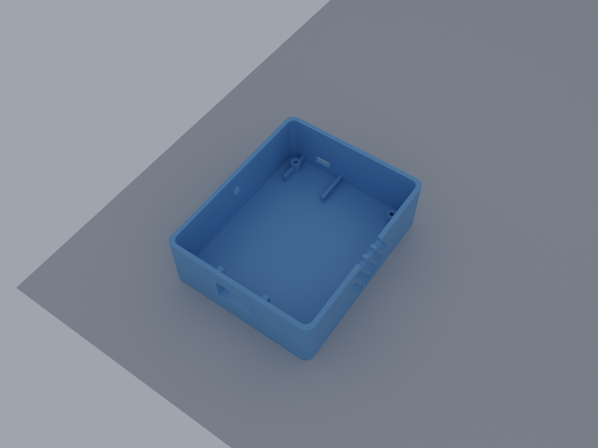
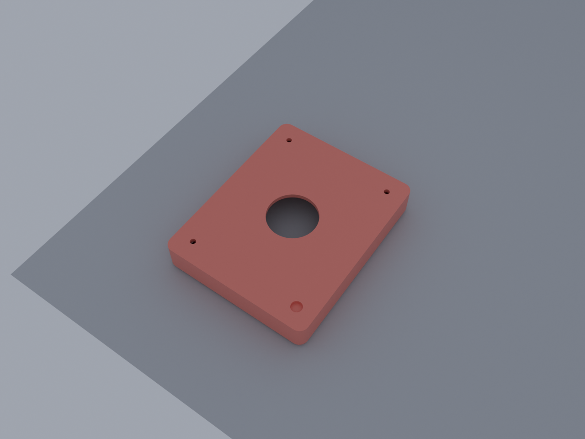
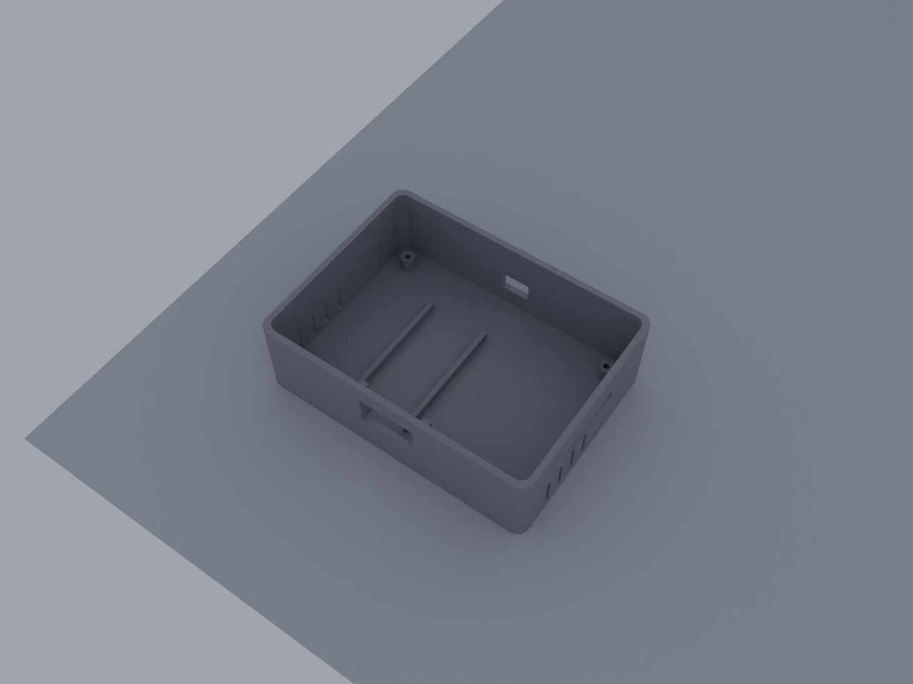
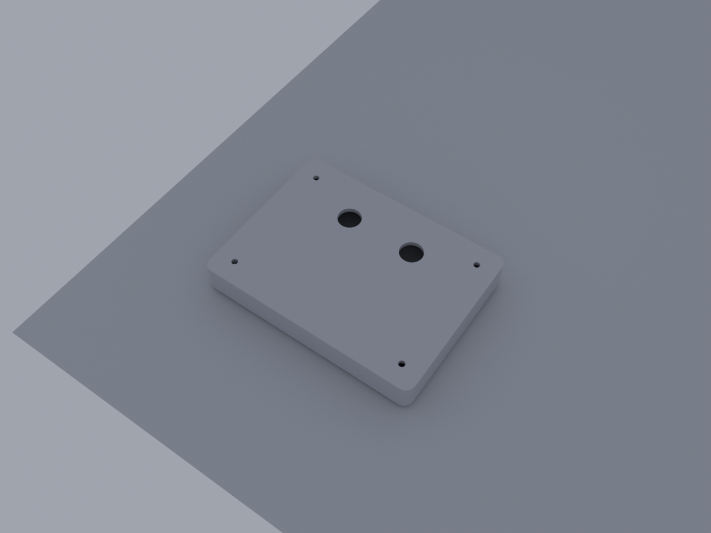
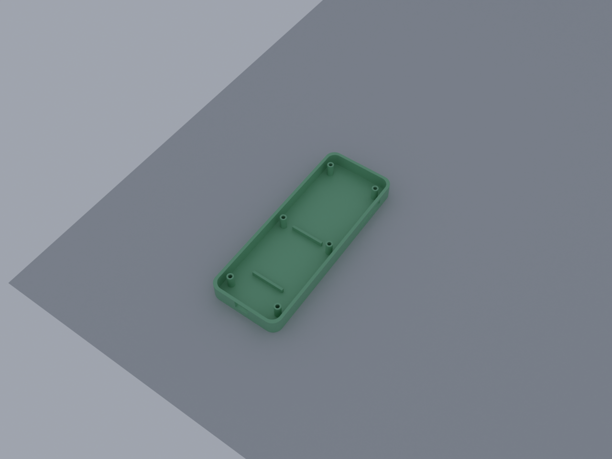
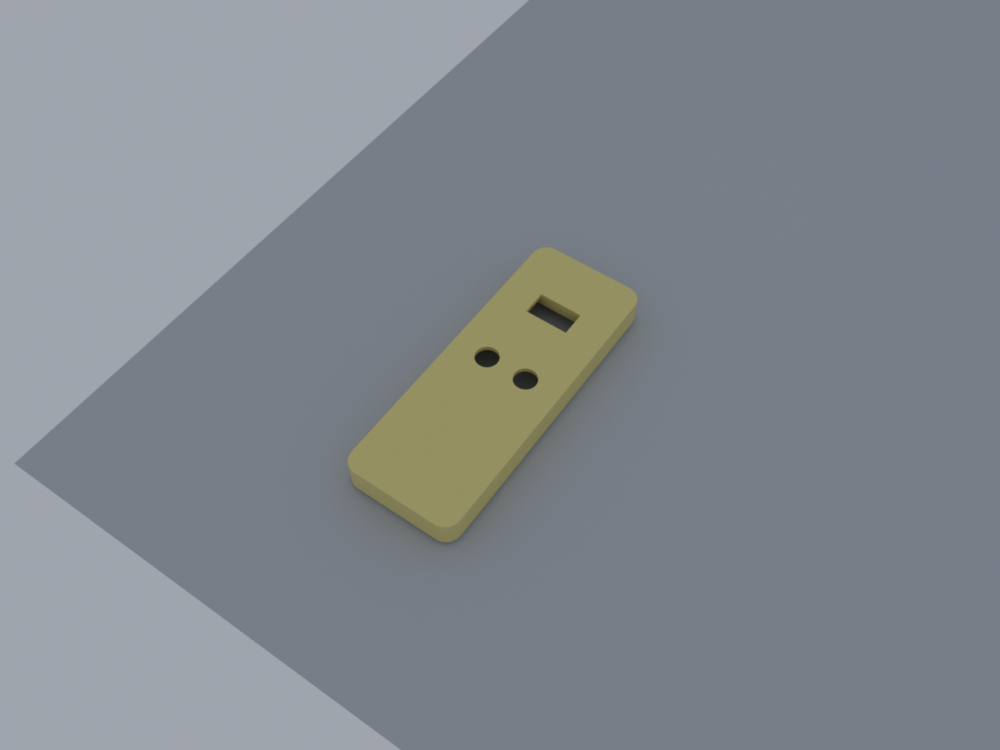

# Quiz Buzzer Enclosures (v3 — Blender-generated)

Six STL files generated parametrically via the Blender MCP socket, with
component dimensions verified against `components-list.md` and manufacturer
datasheets.

## Files

Each STL has a matching `.png` preview rendered in Blender Cycles
(3/4 elevated view) so you can sanity-check the geometry before slicing.

| Part | STL | Preview | Footprint | Height |
|------|-----|---------|-----------|--------|
| Buzzer body (open top, holds ESP32 / battery / TP4056 / boost / speaker) | `buzzer-bottom.stl` |  | 85 × 105 mm | 32.5 mm |
| Buzzer lid (28 mm arcade-button hole) | `buzzer-top.stl` |  | 85 × 105 mm | 17 mm |
| Desktop base body | `base-desktop-bottom.stl` |  | 115 × 85 mm | 34.5 mm |
| Desktop base lid (2× 12 mm buttons) | `base-desktop-top.stl` |  | 115 × 85 mm | 17 mm |
| Handheld back (USB-C + microSD) | `base-handheld-back.stl` |  | 60 × 160 mm | 14 mm |
| Handheld front (display + 2 buttons) | `base-handheld-front.stl` |  | 60 × 160 mm | 16 mm |

To regenerate previews after editing geometry, pipe `render_previews.py`
through the Blender MCP socket (port 9876).

Verified valid (manifold) on import. Two minor non-manifold edges on
`buzzer-bottom.stl` are at the lip seam — slicers handle this fine; if you
want to be paranoid, run through Microsoft 3D Tools or Meshmixer "Make Solid"
before slicing.

## Print orientation

| Part | Orient | Supports |
|------|--------|----------|
| `buzzer-bottom` | Open side **up** | None (skirt or brim recommended for ABS) |
| `buzzer-top` | Closed face **down** (lip points up) | None |
| `base-desktop-bottom` | Open side **up** | None |
| `base-desktop-top` | Closed face **down** | Tree supports under counterbores if your slicer flags them |
| `base-handheld-back` | Open side **up** | None |
| `base-handheld-front` | Closed display face **down** | None |

Settings (matching the existing v1 designs): 0.2 mm layer, 20–30 % infill,
3–4 walls, 4–5 top/bottom layers. Material — PETG or PLA+ for indoor
classroom use; ABS only if you have an enclosed printer.

## Cutout dimensions

### Buzzer (button unit)
| Cutout | Where | Size |
|--------|-------|------|
| Arcade button | Top center | Ø28 mm |
| OLED window | Front, Z=12.5 above floor | 23 × 12 mm |
| Speaker grille | Right side, centered | 40 mm pattern of Ø5 mm holes |
| USB-C (TP4056) | Back, near right side | 10 × 4.5 mm |
| Toggle switch | Left side, centered | Ø6.2 mm |
| Corner screws | All 4 inside corners | M3 self-tap into 2.5 mm post |

### Base station — desktop
| Cutout | Where | Size |
|--------|-------|------|
| OLED window | Front center, Z=14.5 above floor | 23 × 13 mm |
| Buttons | Top, near back, side-by-side | 2 × Ø12 mm |
| USB-C | Back center | 12 × 8 mm |
| microSD | Right side | 30 × 5 mm |
| Vents | Left + right sides | 4 × (12 × 2 mm) per side |

### Base station — handheld
| Cutout | Where | Size |
|--------|-------|------|
| OLED window | Front, near top end | 23 × 13 mm |
| Buttons | Front, below OLED | 2 × Ø12 mm at 22 mm spacing |
| USB-C | Bottom edge (near user's hand) | 12 × 8 mm |
| microSD | Right side, mid-body | 30 × 5 mm |
| Through-screws | 6 × M3 head counterbores on back | Ø3.2 mm clearance |

## Assembly — buzzer

```
                    ARCADE BUTTON (60 mm dome)
                           │
                           ▼ (push-fit through 28 mm hole + nut from below)
  ┌────────────── buzzer-top ──────────────┐
  │                                        │
  │   [   ]  ← 4× M3 × 16 screws into     │
  │                bottom-shell posts      │
  │                                        │
  └────┬──────────── lip ───────────┬──────┘
       │                            │
  ┌────▼────────────────────────────▼──────┐  Y=back
  │  TP4056 ── USB-C  rail  rail            │
  │      └─────────────┘                    │
  │                                         │
  │  503035 LiPo (taped to floor)           │
  │                                         │
  │  [ESP32-C6]   [boost MT3608]            │
  │     │             │                     │
  │     │             └─► 5V to ESP32 VIN   │
  │     │                                   │
  │   [3W speaker, taped to right wall      │
  │    behind grille — wires to GPIO8/GND]  │
  │                                         │
  │  Toggle switch (left wall, 6.2 mm hole) │
  │                                         │
  │  OLED slides into front pocket (3 rails)│
  │                                         │
  └─────────────────────────────────────────┘
                            ▲ Y=front (OLED window here)
```

### Wire path summary (button unit)
1. Battery `BAT+` → TP4056 `B+`; Battery `−` → TP4056 `B−`
2. TP4056 `OUT+` → toggle switch → MT3608 `IN+` → MT3608 set to **5.0 V** → ESP32 `VIN`
3. TP4056 `OUT−` → MT3608 `IN−` → ESP32 `GND` (common ground)
4. ESP32 `3V3` → OLED `VCC`; `GND` → OLED `GND`
5. ESP32 `GPIO6` (SDA) → OLED `SDA`; `GPIO7` (SCL) → OLED `SCL`
6. Arcade button `NO` → ESP32 `3V3`; `COM` → ESP32 `GPIO15`; 10 kΩ from `GPIO15` → `GND`
7. Speaker `+` → ESP32 `GPIO8`; speaker `−` → `GND`
8. 47 kΩ + 47 kΩ divider from TP4056 `OUT+` to `GND`, midpoint → `GPIO1`

## Assembly — base station (either form)

```
  ┌─── lid (top) ──────────────────────┐
  │  [ start ]   [ reset ]   ← 12 mm   │
  │                                    │
  │  4× M3 × 12 corner screws          │
  └───┬────────────── lip ──────┬──────┘
      │                         │
  ┌───▼─────────────────────────▼──────┐  Y=back (USB-C, vents)
  │   ESP32-C6                          │
  │   ├─ GPIO6/7 → OLED I2C             │
  │   ├─ GPIO5/18/19/23 → SD module     │
  │   ├─ GPIO10 → start button (to GND) │
  │   ├─ GPIO1  → reset button (to GND) │
  │   └─ USB-C → power                  │
  │                                     │
  │   microSD module ── slot on right ──│
  │                                     │
  │   OLED behind front window          │
  └─────────────────────────────────────┘
                                  ▲ Y=front (OLED window)
```

The handheld front uses through-screws from the **back face** (counterbored
for screw heads) threading into bosses inside the front half. Use **M3 × 18
or M3 × 20 self-tapping screws** for the handheld; M3 × 12 for the desktop.

## Bill of fasteners

- **8 × M3 × 16** self-tapping (4 buzzer top + 4 desktop base top)
- **6 × M3 × 20** self-tapping (handheld back-to-front)
- Optional: 4 × M3 brass heat-set inserts in each lid if you intend to
  open/close the case repeatedly. The current design uses self-tap into
  printed plastic, which is good for ~10 cycles.

## Source

These STLs are generated from the Python scripts in this directory:
- `build_lib.py` — shared bmesh helpers
- `buzzer_bottom.py`, `buzzer_top.py`
- `base_desktop.py`
- `base_handheld.py`

To regenerate, ensure the Blender MCP add-on is running (port 9876) and
either pipe the script via the socket or run inside Blender's text editor.
The cutout positions and post layouts are parametric — edit constants at
the top of each file to retune.
