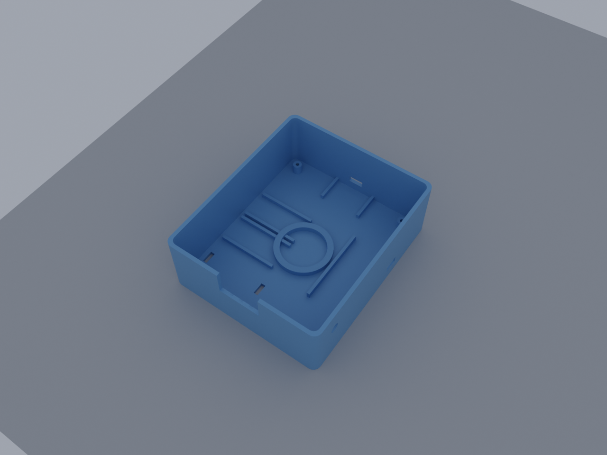
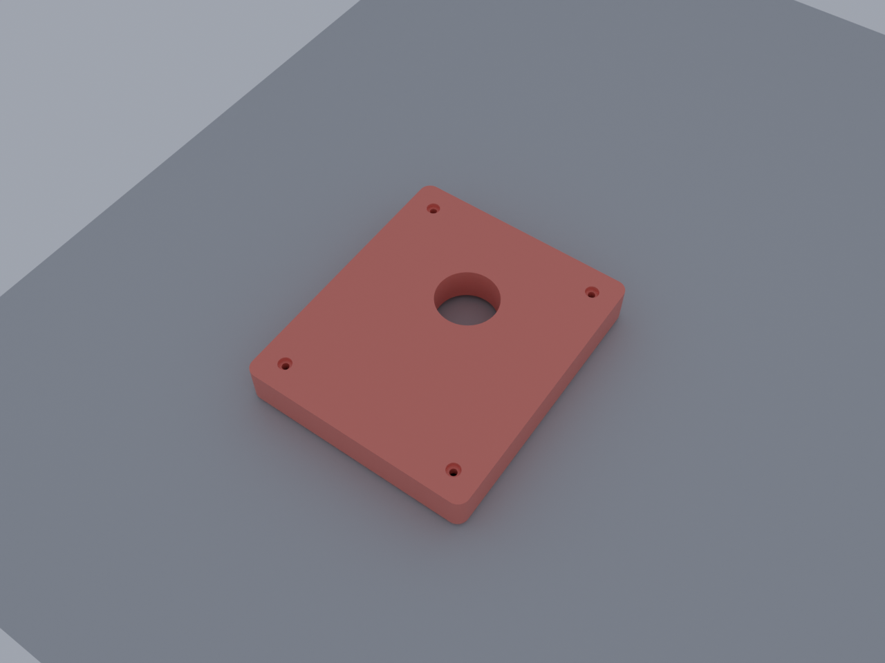
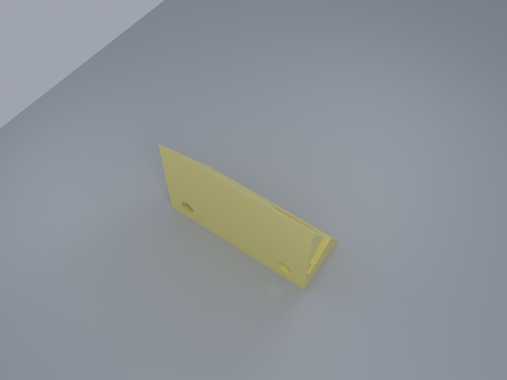
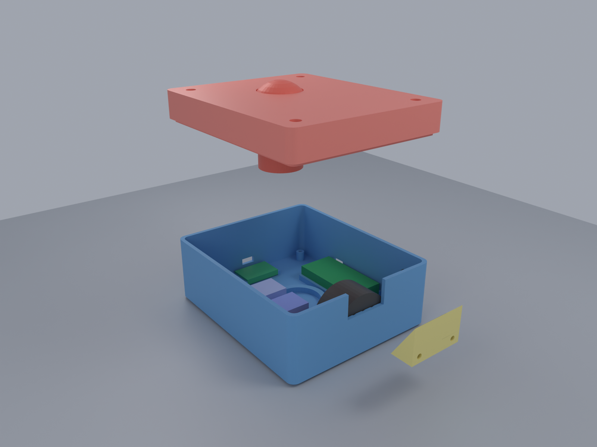
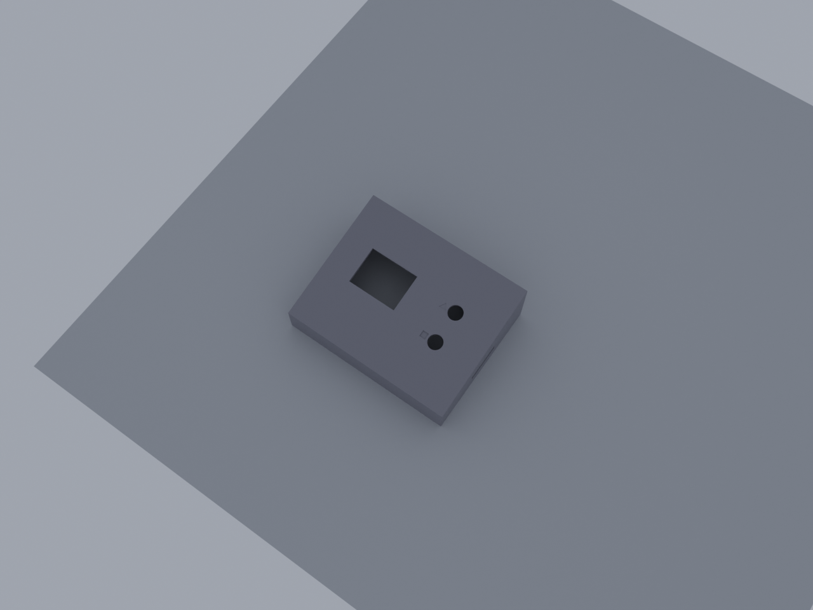
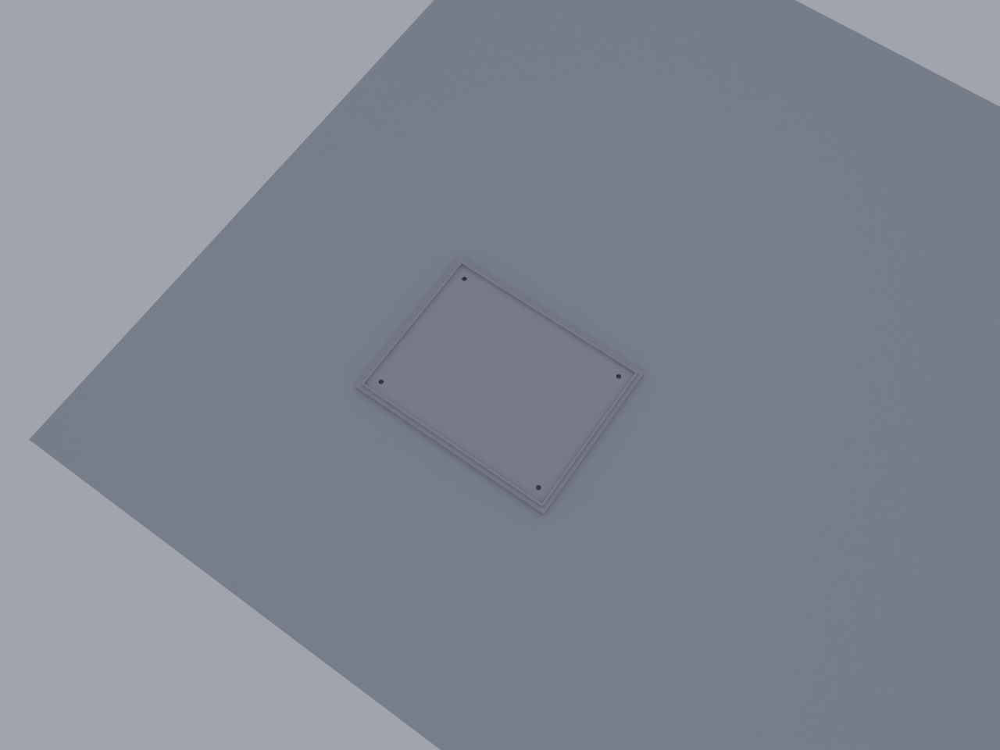
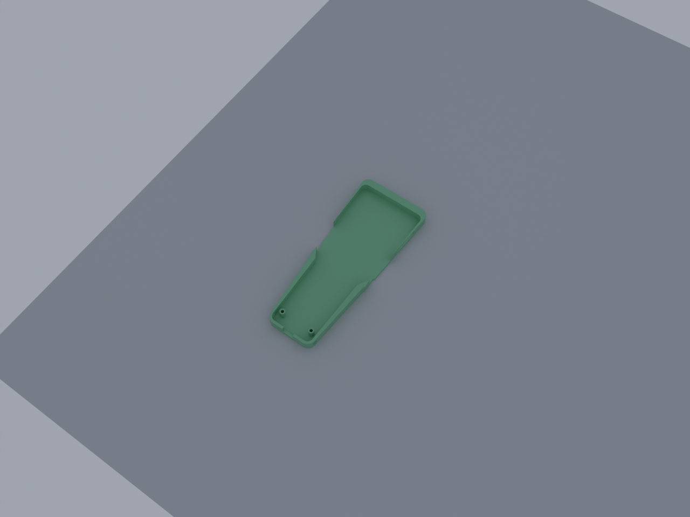
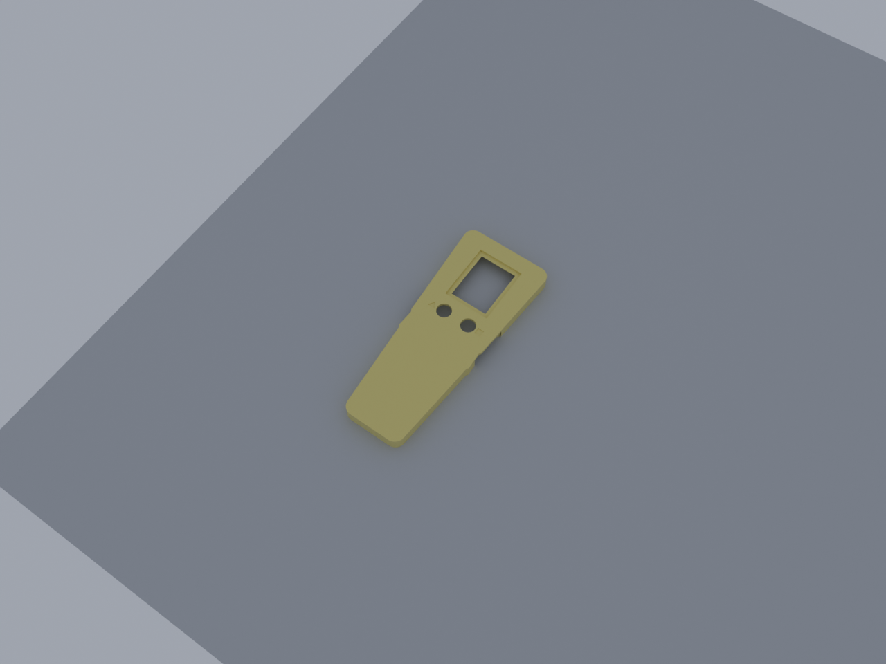

# Quiz Buzzer Enclosures (v4 + v5 refinements)

A from-scratch redesign with explicit design intent rather than just
parametric variation of the v3 boxes. Each form factor was designed
around what the part has to *do*, not just how to fit components.

Generated parametrically via the Blender MCP socket; component cutouts
match the verified manufacturer dimensions in `components-list.md`.

## v5 refinements (latest)

- **Both base stations upgraded to GMT020-02-8p 2.0" TFT** (240×320,
  ST7789V controller). Display window 31×41 mm, PCB pocket 38×63 mm
  internal, 12.5 mm clearance behind the front face. Replaces the 0.96"
  OLED used in v4.
- **Desktop wedge layout changed**: landscape TFT on the left side of
  the angled top, two 12 mm momentary buttons stacked vertically to the
  right of the display. Wedge widened from 130 → 140 mm to fit.
  Triangle / square shape indicators next to each button.
- **Desktop wedge bug fix**: v4 only rendered one of two button holes
  due to rotation state leaking between iterations. Each button now
  builds with explicit transform_apply at every step; both holes
  guaranteed.
- **Handheld redesigned as pistol/wand grip**: head section 75×90 mm
  for display + buttons, narrows through a 12 mm taper to a 50×80 mm
  grip with dot-grid texture. Lanyard cross-bore at the grip tip.
  Total length 182 mm. Outline built via the new
  `make_pistol_outline` helper in `build_lib.py`.
- **Handheld microSD-vs-post collision fixed**: v4 had a screw boss at
  Y = D/2 (right-mid) that intersected the microSD slot's Y range. v5
  asserts at build time that **no boss falls within the slot's Y range
  on the right wall** (currently slot Y = 127–157, right-wall bosses at
  Y = 170 and Y = 120.2 — both outside).
- **`buzzer-assembly.png` added** — exploded 3D view with all components
  (battery, ESP32, TP4056, MT3608 #1, MT3608 #2, speaker, switch,
  arcade button, OLED on bezel) shown in their mounting positions.

## Design intent (what changed from v3)

### Buzzer (3 parts: bottom, lid, bezel)
- **Slam path is structural**: 6 mm-thick lid deck with a 10 mm-tall
  reinforcement collar around the 28 mm arcade-button hole, plus a
  matching compression rib on the bottom shell. Vertical force from
  a 5–10 kg slam routes through the case body, not through the lid lip.
- **Speaker fires forward** (40 mm hex grille on lower front wall),
  not sideways into a desk like v3.
- **Battery retention**: 503035 LiPo sits on the floor with a zip-tie
  through two slots cut in the floor. Replaces v3's "just tape it down."
- **Component rails for everything**: TP4056 (back wall), ESP32 (right
  wall, USB-C debug aligned), MT3608 #1 (5 V — left side), MT3608 #2
  (12 V LED option — also left side).
- **Display moved off the bottom shell** onto a separate **bezel**
  that prints face-down with zero supports. Splits the case into 3
  parts: bottom + lid + bezel. Bezel can be reprinted independently
  if cracked or restyled.
- **Wider footprint**: 105 × 125 mm (was 85 × 105). Lower tip risk
  when struck off-center.
- **Rubber-foot dimples** on the underside (4× Ø6 × 1 mm for 3M Bumpons).

### Desktop base — single wedge
- **Single-piece wedge** instead of box + riser feet. Front 25 mm
  tall, back 45 mm tall, 10° tilt. OLED reads naturally at desk angle.
- **OLED + buttons cut perpendicular to angled top surface** — viewer
  reads them head-on, not through a tilted vertical face.
- **Buttons differentiated by debossed shapes** beside each hole: a
  triangle indicator next to **Start** (left), a square indicator
  next to **Reset** (right). Color caps remain primary differentiation.
- **No side vents** (USB power doesn't need them; vents let in dust).
- Lid is the **back cover** — after assembly the case sits flat on
  its back face and the lid is the screwed-on bottom you removed
  for component access.

### Handheld base (back + front)
- **Side-edge chamfers** (4 × 4 mm) make it feel hand-shaped without
  needing un-printable curves on the back face.
- **Thumb dish** (Ø35 × 1.5 mm deep) on the front face above the buttons
  — gentle dished concavity for thumb position, prints fine since it's
  shallow and on the bed-up face.
- **Recessed OLED window**: display sits 2 mm below the surface so it
  doesn't scratch when laid face-down.
- **Lanyard cross-bore** through a thickened bottom corner. No protruding
  tab — corner thickness is the strap loop. (Tabs are stress concentrators
  that snap; cross-bore distributes load through bulk material.)
- **Dot-grid grip texture** debossed on the back face (40+ dots per side
  patch). Boolean-friendly substitute for the diagonal-ridge pattern that
  would have exploded mesh complexity.

## Files

| Part | STL | Preview | Footprint | Height |
|------|-----|---------|-----------|--------|
| Buzzer body | `buzzer-bottom.stl` |  | 105 × 125 mm | 42.5 mm |
| Buzzer lid (28 mm arcade hole) | `buzzer-lid.stl` |  | 105 × 125 mm | 19 mm (incl. lip) |
| Buzzer display bezel (angled OLED + LED) | `buzzer-bezel.stl` |  | 35 × 14 mm | 22 mm |
| **Buzzer assembly preview** (no STL) | — |  | exploded 3D w/ labeled components | — |
| Desktop wedge body (TFT + 2 buttons) | `base-desktop-wedge.stl` |  | 140 × 110 mm | 25–45 mm |
| Desktop back cover | `base-desktop-lid.stl` |  | 140 × 110 mm | 5 mm |
| Handheld back half (pistol grip) | `base-handheld-back.stl` |  | 75 × 182 mm (head + grip) | 11 mm |
| Handheld front half (pistol grip + TFT) | `base-handheld-front.stl` |  | 75 × 182 mm | 11 mm |

All STLs validated manifold on import-test (a few non-manifold edges on
the buzzer lid at the collar/lip seam — slicers auto-repair).

## Print orientation

| Part | Orient | Supports |
|------|--------|----------|
| `buzzer-bottom` | Open top **up** | None |
| `buzzer-lid` | Closed top **down** (lip up) | None |
| `buzzer-bezel` | Angled face **down** on bed | None |
| `base-desktop-wedge` | Open bottom **up** (stands on its back face) | None |
| `base-desktop-lid` | Flat **either** orientation | None |
| `base-handheld-back` | Open top **up** | None |
| `base-handheld-front` | Closed front face **down** | None |

Settings: 0.2 mm layer, 25 % infill, 3 walls, 5 top/bottom layers.
PETG or PLA+ for indoor classroom use. ABS only with an enclosed printer.

## Assembly — buzzer

```
                  ARCADE BUTTON (60 mm dome, retained by nut from below)
                       ████████
                  ┌──┴───────┴──┐
                  │ buzzer-lid  │     6mm thick top deck
                  │  ┌───┐ ◄────┼──   10mm reinforcement collar
                  │  │   │      │     (rings the 28mm hole)
                  └─┬┴───┴┬─────┘
                    │ lip │
        bezel ─►  ┌─┴─────┴─────┐
        glued     │  ┌───────┐  │     compression rib on floor
        on front  │  │ ESP32 │  │     directly under collar
        wall      │  └───────┘  │
                  │              │
                  │ MT3608  ░░░░ │   battery zip-tied to floor
                  │ MT3608       │   through 2 slots
                  │              │
                  │ ┌──TP4056─┐ ─┼── USB-C charge (back wall)
                  └─┴─────────┴──┘
                  ⊙           ⊙
                  ⊙           ⊙       4× rubber-foot dimples
```

**Wire path** (unchanged from `components-list.md`):
1. Battery → TP4056 `B+/B-`
2. TP4056 `OUT+` → toggle switch → MT3608 #1 (set to 5 V) → ESP32 `VIN`
3. Common ground across battery, TP4056, MT3608s, ESP32, OLED, speaker
4. ESP32 `3V3` + I²C (GPIO6/7) → OLED on bezel
5. ESP32 `GPIO15` ← arcade button NO; 10 kΩ pull-down to GND
6. ESP32 `GPIO8` → speaker (+); GND → speaker (−)
7. ESP32 `GPIO1` ← 47 kΩ + 47 kΩ divider on TP4056 `OUT+` (battery monitor)
8. (Optional) ESP32 `GPIO4` → 1 kΩ → 2N2222 base; collector → MT3608 #2 12 V → arcade-button LED; emitter → 330 Ω → GND

## Assembly — base station (either form)

```
  ┌── back cover (lid) ────────────┐    ┌── front half ──────────┐
  │                                │    │ ┌─OLED┐ recessed 2mm   │
  │  ESP32 mounted to inside       │    │ ╰─────╯                │
  │  microSD module on right       │    │ ◯  ◯  ← buttons w/      │
  │  posts                         │    │ ▲  ■    triangle/square │
  └────────────────────────────────┘    │            indicators   │
                  │                     │  ╭────╮  ← thumb dish    │
                  │ M3 self-tap         │  ╰────╯                  │
                  ▼ corners             │                          │
              (desktop)                 │ ⊙ ⊙ ⊙ ⊙ ⊙ ⊙ ← lanyard   │
                                        │     cross-bore in corner │
                                        └──────────────────────────┘
```

## Bill of fasteners

- **Buzzer**: 4× M3 × 16 self-tap (lid into bottom posts) + 2× M3 × 8
  for bezel into bottom-shell front wall (or hot glue if you'd rather
  skip the screws)
- **Desktop**: 4× M3 × 12 self-tap (lid into wedge corner posts)
- **Handheld**: 6× M3 × 18 self-tap (back-to-front through-screws)

## Source

Each STL is generated from a Python script piped to the Blender MCP
socket on port 9876:

- `build_lib.py` — shared bmesh helpers (`make_rounded_extrusion`,
  `make_wedge_shell`, `make_dot_grid`, `make_dish_indent`, `make_collar`,
  boolean wrappers, STL export)
- `render_helper.py` — Cycles preview pipeline (3-point lights,
  mid-grey background, 64 samples)
- `buzzer_bottom.py`, `buzzer_lid.py`, `buzzer_bezel.py`
- `base_desktop_wedge.py`, `base_desktop_lid.py`
- `base_handheld_back.py`, `base_handheld_front.py`

Each part script: clears the scene, builds the geometry, exports STL,
renders PNG, and prints mesh stats to stdout.

To regenerate after editing constants, pipe the script via:
```bash
python3 /tmp/blender_client.py < buzzer_bottom.py
```
where `blender_client.py` is a tiny socket client sending null-byte-
delimited JSON `{"type": "execute", "code": <script>, "strict_json": true}`
to `localhost:9876`.

## Why three buzzer parts?

The 60 mm arcade button gets *slammed*. The single biggest improvement
over v3 was making the slam path explicit: thicker top deck + reinforcement
collar + compression rib = vertical force routes through case structure
into the desk. The lid lip is no longer load-bearing.

The angled OLED display required either a chamfered face on the lid
(which can't print without supports right at the display window) or a
separate bezel that prints face-down. The bezel option preserves an
ergonomic display angle without sacrificing print quality. It also lets
you reprint just the bezel if the display gets damaged.
